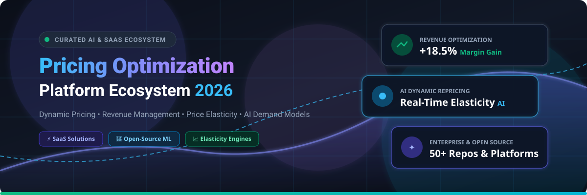

# 🏷️ Awesome Pricing Optimization Platform Ecosystem

<p align="center">
  
</p>

<p align="center">
  <a href="https://github.com/ishandutta2007/Awesome-Awesome-Awesome"></a>
  <a href="https://discord.gg/jc4xtF58Ve"></a>
  <a href="https://github.com/ishandutta2007/Awesome-Pricing-Optimization-Platform/stargazers"></a>
  <a href="https://github.com/ishandutta2007/Awesome-Pricing-Optimization-Platform/network/members"></a>
  <a href="https://github.com/ishandutta2007/Awesome-Pricing-Optimization-Platform/blob/main/LICENSE"></a>
  <a href="https://github.com/ishandutta2007/Awesome-Pricing-Optimization-Platform/pulls"></a>
  <a href="https://github.com/ishandutta2007"></a>
</p>

---

> 🚀 **A curated, battle-tested directory of enterprise SaaS solutions, open-source algorithms, machine learning models, and architectural blueprints for AI-driven dynamic pricing, revenue management, demand elasticity estimation, and competitive pricing intelligence.**

Last updated: September 2026 • Curated with ❤️ for pricing teams, data scientists, revenue managers, e-commerce retailers, and ML engineers.

---

## 📑 Table of Contents

- [🎯 Overview & Industry Scope](#-overview--industry-scope)
- [🏢 SaaS & Hosted Commercial Platforms](#-saas--hosted-commercial-platforms)
- [🧠 Open-Source GitHub Repositories & Libraries](#-open-source-github-repositories--libraries)
  - [🤖 Machine Learning & Demand Forecasting](#-machine-learning--demand-forecasting)
  - [🎯 Causal Inference & Price Elasticity](#-causal-inference--price-elasticity)
  - [🧮 Mathematical Optimization & Solvers](#-mathematical-optimization--solvers)
  - [🎮 Reinforcement Learning & Dynamic Pricing Environments](#-reinforcement-learning--dynamic-pricing-environments)
  - [🕵️ Competitor Intelligence & Market Scraping](#️-competitor-intelligence--market-scraping)
  - [📊 BI, Dashboards & MLOps Infrastructure](#-bi-dashboards--mlops-infrastructure)
  - [🧪 Pricing Experimentation & A/B Testing](#-pricing-experimentation--ab-testing)
- [🏗️ Production-Grade Self-Hosted Architecture](#️-production-grade-self-hosted-architecture)
- [🤝 How to Contribute](#-how-to-contribute)
- [📈 Star History](#-star-history)
- [⚖️ Disclaimer](#️-disclaimer)

---

## 🎯 Overview & Industry Scope

Pricing optimization represents the intersection of **econometrics, machine learning, operations research, and real-time data engineering**. These platforms and frameworks empower organizations to dynamically compute profit-maximizing and revenue-optimal price points across millions of SKUs by evaluating:

- 📊 **Demand Elasticity**: Estimating true price sensitivity without confounding bias.
- ⚡ **Competitive Price Intelligence**: Real-time competitor tracking and automated margin-safe repricing.
- 📦 **Inventory & Supply Constraints**: Balancing stock depletion rates with gross margin yield.
- 🏷️ **Promotional Effectiveness**: Modeling markdown curves, discounts, and customer willingness to pay (WTP).
- 🤝 **B2B Quoting & CPQ**: AI-guided deal pricing, margin floors, and price waterfall transparency.

---

## 🏢 SaaS & Hosted Commercial Platforms

> 📊 **Market Size & Structure**: The global Price Optimization and Revenue Management Software market is valued at approximately **$2.8B – $3.5B+ (2025–2026)** and is on track to exceed **$6.2B+ by 2030** (growing at an estimated **~14.5% CAGR**). The market is **moderately fragmented**—anchored on one side by large enterprise B2B suites (such as RELEX, PROS, Vendavo, Zilliant, and Pricefx) that command multi-year contracts, and on the other side by a vibrant ecosystem of agile dynamic-pricing and retail-repricing tools (such as Competera, Omnia Retail, Prisync, BlackCurve, and Symson) catering to e-commerce and mid-market brands.

*The table below is sorted by **Company Scale / Valuation / Revenue** in descending order:*

| Platform | Description | Company Scale / Valuation / Revenue | Pricing (Starting Tier) | Free Tier / Trial Limits |
| :--- | :--- | :--- | :--- | :--- |
| **[RELEX Solutions](https://www.relexsolutions.com)** | AI-driven retail planning and supply chain optimization platform delivering integrated demand forecasting, price optimization, and markdown planning. | **~$5.7B Valuation** (Blackstone-backed unicorn, ~$250M+ ARR) | Starts at **~$50,000/year** (~$4,166/month) for modular mid-market deployments; full enterprise deployments range from $200,000 to $1,000,000+/year. | No free forever plan; no self-serve free trial. Live customized demo and supply-chain/pricing simulation with retailer data on request. |
| **[PROS](https://pros.com)** | Enterprise AI-powered pricing and revenue management platform supporting CPQ, dynamic price guidance, revenue optimization, and omnichannel sales execution. | **~$1.6B Market Cap** (NYSE: PRO, ~$330M+ Annual Revenue) | Starts at **~$6,250/month** (~$75,000/year billed annually) for core price optimization modules; scales by transaction volume and user seats. | No free forever plan; no self-serve free trial. Live guided demo, value assessment, and sandbox evaluation available upon sales qualification. |
| **[Vendavo](https://www.vendavo.com)** | B2B commercial intelligence, price optimization, and margin improvement platform providing deal guidance, price waterfalls, and rebate management. | **~$1.0B+ Valuation** (Francisco Partners / Accel-KKR, ~$120M+ Revenue) | Starts at **~$5,000/month** (~$60,000/year annual contract) for core deal price optimization modules; scales based on SKU count and integration depth. | No free forever plan; no self-serve free trial. Tailored product demonstration and commercial value discovery workshop on request. |
| **[Zilliant](https://zilliant.com)** | End-to-end B2B price management and price optimization software delivering AI-driven price elasticity, segmentation, and sales rep guidance. | **~$800M–$1.0B Valuation** (Madison Dearborn Partners, ~$100M+ Revenue) | Starts at **~$4,000–$5,000/month** (~$50,000/year annual agreement) for entry pricing guidance modules; scales by company revenue and transaction scope. | No free forever plan; no self-serve free trial. Custom proof-of-value demo and historical transaction data audit available on request. |
| **[Pricefx](https://www.pricefx.com)** | Cloud-native pricing platform offering modular price optimization, price setting, CPQ, rebate management, and real-time pricing analytics. | **~$500M–$600M Valuation** (Apax Digital / Series C, ~$70M+ ARR) | Starts at **~$8,333/month** (~$100,000/year annual contract); entry training and implementation packages start from €4,000–€10,500. | No free forever plan; no self-serve free trial. Guided interactive sandbox demo and proof-of-concept pilot available on request. |
| **[Revionics](https://revionics.com)** | Science-backed retail pricing platform leveraging machine learning to model consumer demand, optimize base prices, promotions, and markdown strategies. | **~$200M+ Valuation** (Acquired by Aptos / Goldman Sachs Merchant Banking, ~$50M+ Revenue) | Starts at **~$5,000/month** (~$60,000/year annual contract) for core retail base price optimization; scales with store footprint and SKU catalog size. | No free forever plan; no self-serve free trial. Pricing strategy checkup, AI simulation walk-through, and guided demo available on request. |
| **[Wiser Solutions](https://www.wiser.com)** | Omnichannel commerce intelligence platform offering automated competitor repricing, MAP compliance monitoring, and retail catalog tracking. | **~$150M–$200M Valuation** (Quad-C / MidOcean Partners, ~$30M+ Revenue) | Starts at **~$699/month** (~$8,388/year billed annually) for entry-tier online price monitoring and MAP compliance tracking. | No free forever plan; no self-serve trial. Free strategy consultation, live competitive data audit, and platform demo available on request. |
| **[IntelligenceNode](https://www.intelligencenode.com)** | Real-time retail intelligence and AI price tracking platform monitoring billions of SKUs across competitive digital storefronts. | **~$100M–$150M Valuation** (VC-backed, ~$20M+ ARR) | Starts at **~$5,000/month** (~$60,000/year minimum engagement) for automated SKU tracking and competitive intelligence feeds. | No free forever plan; no self-serve free trial. Custom retail audit, live product walkthrough, and sample competitor crawl available upon request. |
| **[Buynomics](https://www.buynomics.com)** | AI-driven Revenue Growth Management (RGM) platform using Virtual Customers to simulate consumer willingness to pay, portfolio pricing, and promotions. | **~$60M–$80M Valuation** (Insight Partners / Series A, ~$10M+ Revenue) | Starts at **~€997–€1,500/month** (~$1,100–$1,650/month, billed annually) for core Revenue Growth Management (RGM) simulation modules. | No free forever plan; no self-serve trial. Free access to RGM Academy certification courses, interactive scenario demo, and guided pilot on request. |
| **[Competera](https://competera.ai)** | Retail dynamic pricing platform powered by deep learning that models cross-elasticity, demand forecasting, and competitive market signals. | **~$50M–$80M Valuation** (VC-backed Series A, ~$12M+ ARR) | Starts at **~$750/month** for SMB competitive monitoring; enterprise dynamic pricing & elasticity modules start at **~$4,166/month** (~$50,000/year). | No free forever plan; no self-serve trial. Proof of Concept (PoC) pilot (typically 30–60 days with historical data audit) and live demo on request. |
| **[Omnia Retail](https://www.omniaretail.com)** | Integrated retail pricing automation suite providing competitor price scraping, dynamic repricing algorithms, and Google Shopping bid adjustments. | **~$40M–$60M Valuation** (Acquired by Pricer AB, ~$12M+ Revenue) | Starts at **€399/month** (~$430/month) for SMB Single-Shop plan (AI price monitoring & dynamic pricing, up to 5 user seats). Enterprise multi-shop plans are quote-based. | No free forever plan; no self-serve trial. Interactive live product demo and custom data consultation available upon request. |
| **[Prisync](https://prisync.com)** | Automated competitor price tracking, monitoring, and dynamic repricing platform tailored for e-commerce retailers, Shopify brands, and merchants. | **~$30M–$50M Valuation** (High-growth profitable SaaS, ~$10M+ ARR) | Starts at **$99/month** (Professional plan for up to 100 products; **$49/month** for Shopify merchants). Premium at $199/mo (1,000 products); Platinum at $399/mo (5,000 products). | No free forever plan; **14-day free trial** with full feature access, up to 100 products tracked, no credit card required. |
| **[PriceBeam](https://www.pricebeam.com)** | Cloud market research platform that analyzes willingness to pay (WTP), willingness-to-buy curves, and optimal price points across 100+ countries. | **~$15M–$25M Valuation** (Private boutique SaaS, ~$5M+ Revenue) | Starts at **$4,995/project** for single willingness-to-pay studies; continuous tracking subscriptions start at **~$800–$1,200/month** billed annually. | No free forever plan; **14-day free trial** / guided evaluation study for qualified research teams upon request. |
| **[Symson](https://www.symson.com)** | AI pricing platform that automates pricing workflows, combining competitor tracking, margin requirements, and demand elasticity modeling. | **~$15M–$25M Valuation** (European VC-backed SaaS, ~$4M+ Revenue) | Starts at **€997/month** (~$1,080/month flat rate) for core AI price optimization engine and competitor monitoring. | No free forever plan; **14-day free trial** with sample/custom data ingestion and guided workflow onboarding upon request. |
| **[BlackCurve](https://www.blackcurve.com)** | Automated pricing rule engine and dynamic repricing software helping e-commerce sellers optimize product margins and sales velocity. | **~$10M–$20M Valuation** (Mercia-backed, ~$3M–$5M Revenue) | Starts at **£199/month** (~$250/month, billed annually) for Team plan (up to 5,000 SKUs, standard pricing rules, quotation builder). Professional plan starts at £699/month. | No free forever plan; **30-day free trial** providing full access to Enterprise tier features and pricing rule simulations. |

---

## 🧠 Open-Source GitHub Repositories & Libraries

*All repositories are ranked by **GitHub Star Count** in descending order. Each badge links directly to the repository's official stargazers page.*

### 🚀 Top Featured Open-Source Projects

1. **[Playwright](https://github.com/microsoft/playwright)** [](https://github.com/microsoft/playwright/stargazers)  
   ⚡ Fast, reliable headless browser automation for high-scale competitor price scraping, bot detection evasion, and multi-region e-commerce catalog crawling.

2. **[Grafana](https://github.com/grafana/grafana)** [](https://github.com/grafana/grafana/stargazers)  
   📈 Open-source observability and analytics platform for real-time visualization of live price adjustments, profit margins, conversion rates, and revenue KPIs.

3. **[Apache Superset](https://github.com/apache/superset)** [](https://github.com/apache/superset/stargazers)  
   📊 Enterprise-ready business intelligence platform and data exploration tool ideal for constructing rich pricing dashboards on top of SQL databases.

4. **[scikit-learn](https://github.com/scikit-learn/scikit-learn)** [](https://github.com/scikit-learn/scikit-learn/stargazers)  
   🧠 Foundational Python machine learning library providing linear regressions, clustering, and preprocessing for baseline price elasticity and customer segmentation.

5. **[Scrapy](https://github.com/scrapy/scrapy)** [](https://github.com/scrapy/scrapy/stargazers)  
   🕷️ Fast, high-level web crawling and scraping framework for asynchronous competitive price extraction and automated catalog monitoring pipelines.

6. **[Metabase](https://github.com/metabase/metabase)** [](https://github.com/metabase/metabase/stargazers)  
   💡 Simple, intuitive business intelligence tool that lets pricing analysts explore margin distributions, competitor spreads, and revenue performance without SQL.

7. **[Ray RLlib](https://github.com/ray-project/ray)** [](https://github.com/ray-project/ray/stargazers)  
   🌐 Distributed reinforcement learning library capable of training high-throughput dynamic pricing policies and multi-agent competitive market simulations.

8. **[XGBoost](https://github.com/dmlc/xgboost)** [](https://github.com/dmlc/xgboost/stargazers)  
   ⚡ Optimized distributed gradient boosting library widely used as the workhorse for retail demand forecasting, price sensitivity modeling, and conversion rate prediction.

9. **[MLflow](https://github.com/mlflow/mlflow)** [](https://github.com/mlflow/mlflow/stargazers)  
   🔄 Open-source MLOps platform for tracking price model experiments, managing versioned pricing models, and orchestrating automated retraining pipelines.

10. **[Prophet](https://github.com/facebook/prophet)** [](https://github.com/facebook/prophet/stargazers)  
    📅 Time-series forecasting framework designed to handle strong seasonal effects, holidays, and trend shifts across historical pricing and demand data.

11. **[LightGBM](https://github.com/microsoft/LightGBM)** [](https://github.com/microsoft/LightGBM/stargazers)  
    🚀 Ultra-fast, tree-based gradient boosting framework optimized for high-volume SKU-level demand forecasting and non-linear price interaction features.

12. **[SciPy Optimize](https://github.com/scipy/scipy)** [](https://github.com/scipy/scipy/stargazers)  
    🔬 Core numerical computation library providing nonlinear optimization, constraint minimization, and curve fitting for empirical revenue functions.

13. **[Optuna](https://github.com/optuna/optuna)** [](https://github.com/optuna/optuna/stargazers)  
    🎯 Automatic hyperparameter optimization software for fine-tuning demand forecasting models, pricing policy parameters, and RL reward weights.

14. **[OR-Tools](https://github.com/google/or-tools)** [](https://github.com/google/or-tools/stargazers)  
    🧩 Google's fast mathematical optimization suite for linear, integer, and constraint programming to solve constrained commercial pricing and product bundling.

15. **[Stable-Baselines3](https://github.com/DLR-RM/stable-baselines3)** [](https://github.com/DLR-RM/stable-baselines3/stargazers)  
    🤖 Production-ready PyTorch implementations of reinforcement learning algorithms (PPO, DQN, SAC) for training autonomous dynamic pricing agents.

16. **[Gymnasium](https://github.com/Farama-Foundation/Gymnasium)** [](https://github.com/Farama-Foundation/Gymnasium/stargazers)  
    🕹️ Standard API for reinforcement learning environments, providing the foundation for custom pricing simulation gyms with simulated customer demand.

17. **[Darts](https://github.com/unit8co/darts)** [](https://github.com/unit8co/darts/stargazers)  
    ⏱️ Unified Python time-series library supporting classical ARIMA/ETS and deep learning models (N-BEATS, TFT) for multi-horizon demand forecasting.

18. **[CatBoost](https://github.com/catboost/catboost)** [](https://github.com/catboost/catboost/stargazers)  
    🐱 Gradient boosting library with state-of-the-art native support for high-cardinality categorical features like Store IDs, SKU barcodes, and buyer tiers.

19. **[DoWhy](https://github.com/py-why/dowhy)** [](https://github.com/py-why/dowhy/stargazers)  
    🔍 Causal inference engine that isolates true price elasticity from confounders (promotions, seasonality, competitor actions) using causal graphs.

20. **[GrowthBook](https://github.com/growthbook/growthbook)** [](https://github.com/growthbook/growthbook/stargazers)  
    🧪 Open-source A/B testing and feature flagging platform for designing, executing, and statistically validating live pricing experiments.

21. **[Feast](https://github.com/feast-dev/feast)** [](https://github.com/feast-dev/feast/stargazers)  
    🗄️ Open-source feature store ensuring consistent real-time and historical feature serving (competitor prices, stock counts, elasticity scores) to pricing models.

22. **[CVXPY](https://github.com/cvxpy/cvxpy)** [](https://github.com/cvxpy/cvxpy/stargazers)  
    📐 Domain-specific language for convex optimization, ideal for constrained multi-product price setting under margin, inventory, and budget constraints.

23. **[CausalML](https://github.com/uber/causalml)** [](https://github.com/uber/causalml/stargazers)  
    🎯 Uber's uplift modeling and causal ML toolkit for estimating heterogeneous treatment effects to personalize discounts and optimize coupon allocation.

24. **[StatsForecast](https://github.com/Nixtla/statsforecast)** [](https://github.com/Nixtla/statsforecast/stargazers)  
    ⚡ Lightning-fast statistical and econometric time-series models (AutoARIMA, ETS, CES) designed for massive parallel SKU demand forecasting.

25. **[EconML](https://github.com/microsoft/EconML)** [](https://github.com/microsoft/EconML/stargazers)  
    🔬 Microsoft's causal machine learning library combining Double Machine Learning and instrumental variables to estimate price elasticity curves.

26. **[Pyomo](https://github.com/Pyomo/pyomo)** [](https://github.com/Pyomo/pyomo/stargazers)  
    ⚙️ Comprehensive Python-based mathematical optimization modeling language for complex linear, nonlinear, and mixed-integer price optimization problems.

27. **[PuLP](https://github.com/coin-or/pulp)** [](https://github.com/coin-or/pulp/stargazers)  
    📦 Clean linear programming library in Python that interfaces with popular solvers (CBC, GLPK, Gurobi, CPLEX) for commercial price formulation.

28. **[MLForecast](https://github.com/Nixtla/mlforecast)** [](https://github.com/Nixtla/mlforecast/stargazers)  
    🌲 High-performance framework for recursive machine learning time-series forecasting across thousands of retail product hierarchies.

29. **[DoubleML](https://github.com/DoubleML/doubleml-for-py)** [](https://github.com/DoubleML/doubleml-for-py/stargazers)  
    ⚖️ Object-oriented Python library implementing Double Machine Learning to eliminate regularization bias when measuring causal price sensitivity.

30. **[PricePilot](https://github.com/tomasmcguinness/PricePilot)** [](https://github.com/tomasmcguinness/PricePilot/stargazers)  
    ✈️ Dynamic pricing dashboard and recommendation system combining XGBoost demand models, SHAP explainability, PPO reinforcement learning, and Streamlit.

31. **[NeuroPrice](https://github.com/archinetai/neuroprice)** [](https://github.com/archinetai/neuroprice/stargazers)  
    🧠 Open-source dynamic pricing engine combining reinforcement learning and causal inference for price-demand simulation.

32. **[Awesome Public Datasets](https://github.com/awesomedata/awesome-public-datasets)** [](https://github.com/awesomedata/awesome-public-datasets/stargazers)  
    📂 Collection of open-source datasets including retail transaction logs, e-commerce pricing feeds, demand history, and airline yield management records.

---

## 🏗️ Production-Grade Self-Hosted Architecture

To build a fully self-hosted, explainable, and compliant pricing optimization platform, combine the following building blocks:

```
┌────────────────────────────────────────────────────────────────────────┐
│                        1. DATA INGESTION & PIPELINE                    │
│   • Scrapy / Playwright (Competitor Scrapes)  • PostgreSQL / ClickHouse│
│   • Feast (Real-time Feature Store)           • Apache Kafka / Spark   │
└───────────────────────────────────┬────────────────────────────────────┘
                                    │
┌───────────────────────────────────▼────────────────────────────────────┐
│                    2. DEMAND & ELASTICITY ESTIMATION                   │
│   • LightGBM / XGBoost / CatBoost (SKU-Level Demand Forecasting)       │
│   • EconML / DoubleML / DoWhy (Causal Price Elasticity & Confounding)  │
└───────────────────────────────────┬────────────────────────────────────┘
                                    │
┌───────────────────────────────────▼────────────────────────────────────┐
│                   3. CONSTRAINED MATHEMATICAL OPTIMIZATION             │
│   • Google OR-Tools / Pyomo / CVXPY / PuLP                             │
│   • Business Guardrails: Min/Max Margins, MAP Rules, Inventory Bounds  │
└───────────────────────────────────┬────────────────────────────────────┘
                                    │
┌───────────────────────────────────▼────────────────────────────────────┐
│                  4. EXPERIMENTATION, SERVING & MONITORING              │
│   • GrowthBook (A/B Price Tests)    • FastAPI (Real-Time Price API)   │
│   • MLflow (Model Tracking)         • Grafana / Metabase / Superset    │
└────────────────────────────────────────────────────────────────────────┘
```

---

## 🤝 How to Contribute

Contributions are warmly welcomed! To contribute an enterprise SaaS platform or open-source pricing library:

1. **Fork the repository** on GitHub.
2. **Create a branch** for your feature (`git checkout -b add-pricing-tool`).
3. **Add your entry** following the existing format:
   - For **SaaS**: Add entry to table with platform name, link, description, company valuation/revenue, starting price tier, and free trial limits.
   - For **Open-Source**: Add repo with its official link, GitHub star badge (`[](https://github.com/{owner}/{repo}/stargazers)`), and description in order of star count.
4. **Submit a Pull Request** with a concise description of the platform.
5. ⭐ **Star the repo** if you find it valuable!

---

## 📈 Star History

[](https://star-history.dera.page/#ishandutta2007/Awesome-Pricing-Optimization-Platform&type=date&legend=top-left)

---

## ⚖️ Disclaimer

*This repository is a community-curated collection intended for research, architectural guidance, and educational purposes. Pricing optimization decisions carry contractual, regulatory, competition-law, and consumer-fairness obligations. Always validate dynamic pricing algorithms with business guardrails and legal compliance standards.*

---

<p align="center">
  <b><a href="https://github.com/ishandutta2007/Awesome-Awesome-Awesome">Explore More Awesome Lists</a></b> • 
  <b><a href="https://discord.gg/jc4xtF58Ve">Join Discord Community</a></b>
</p>
